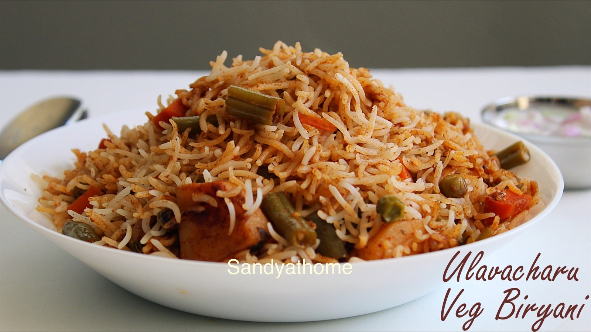
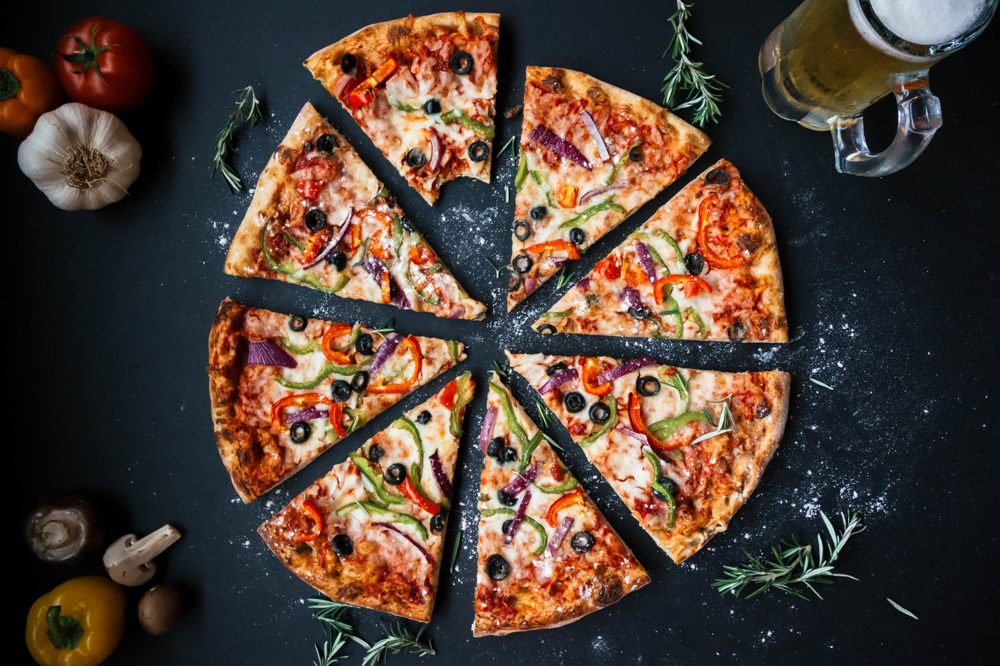

<div align="center">


# KhanaKhazana 👨‍🍳

### *The taste you deserve.*

A warm, single-page ordering experience built for lovers of Indian vegetarian cuisine — browse a curated menu, build a live cart, and check out, without ever leaving the page.

[](https://developer.mozilla.org/en-US/docs/Web/HTML)
[](https://developer.mozilla.org/en-US/docs/Web/CSS)
[](https://developer.mozilla.org/en-US/docs/Web/JavaScript)
[](https://khanakhazaana.netlify.app/)

**[🌐 Visit the Live Site](https://khanakhazaana.netlify.app/)&nbsp;&nbsp;·&nbsp;&nbsp;[🛒 Order Now](https://khanakhazaana.netlify.app/order)&nbsp;&nbsp;·&nbsp;&nbsp;[📂 Repository](https://github.com/krishagrawal30/khanakhazana)**

</div>

<br>

## Table of Contents

- [About](#about)
- [Features](#features)
- [Tech Stack](#tech-stack)
- [Menu Preview](#menu-preview)
- [Live Demo](#live-demo)
- [Getting Started](#getting-started)
- [Project Structure](#project-structure)
- [Roadmap](#roadmap)
- [Team](#team)
- [Connect](#connect)
- [License](#license)

---

## About

**KhanaKhazana** — literally, *"a treasury of food"* — is a front-end web project built around a simple idea: ordering a home-style Indian vegetarian meal online should feel as warm and unhurried as the meal itself.

The site tells the story of a restaurant serving vegetarian Indian food since 2011, and carries that story through a single, flowing page: a welcoming hero with an ambient culture video, an About section, a hand-picked menu gallery, a fully working Order page, and a Contact section — all wrapped in a rustic sienna-and-gold visual identity.

It's built entirely with **HTML, CSS, and JavaScript** — no frameworks, no backend, no build step — and deployed live on Netlify.

## Features

- 🧭 **Single-page navigation** — Home, About, Menu, Order, and Contact sections linked by smooth, JavaScript-powered anchor scrolling
- 🎬 **Ambient hero video** — a looping culture video sets the mood the moment visitors land
- 🖼️ **Curated menu gallery** — 15 vegetarian favorites, from Shahi Biryani to Oreo Shakes, each with its own photograph
- 🛒 **A genuinely interactive cart** — add dishes, adjust quantities on the fly, watch the running total update, and clear the cart, all client-side with zero page reloads
- ✅ **Validated checkout** — a delivery-details form checks for a valid 10-digit mobile number and a well-formed email before confirming the order
- 💵 **Cash-on-delivery confirmation** — a clear confirmation message once an order is placed
- 🎨 **A distinct visual identity** — a sienna-and-gold palette, soft card shadows, an animated gradient wordmark, and a Georgia/Poppins typographic pairing throughout
- 📱 **Direct social integration** — one tap through to Instagram, WhatsApp, Twitter, or email
- ⚡ **Zero dependencies** — pure HTML, CSS, and JavaScript, so it loads fast and deploys anywhere

## Tech Stack

| Layer | Technology |
|---|---|
| Markup | HTML5 |
| Styling | CSS3 — Flexbox, keyframe animations, gradient text, transitions |
| Behavior | Vanilla JavaScript — DOM manipulation, form validation, cart state |
| Typography | Google Fonts (Poppins) paired with Georgia / Segoe UI |
| Hosting | [Netlify](https://www.netlify.com/) |

No frameworks, no package manager, no build tooling — just the fundamentals, done carefully.

## Menu Preview

<div align="center">

|  |  |  |  |  |
|:---:|:---:|:---:|:---:|:---:|
| Shahi Biryani | Margherita Pizza | Shahi Paneer | Tandoori Naan | Steamed Momos |

*...and 10 more dishes waiting on the [live menu](https://khanakhazaana.netlify.app/#menu).*

</div>

## Live Demo

<div align="center">

</div>

KhanaKhazana is live and fully interactive — no sign-up required.

| | |
|---|---|
| 🌐 **Live Site** | [khanakhazaana.netlify.app](https://khanakhazaana.netlify.app/) |
| 🛒 **Order Now** | [khanakhazaana.netlify.app/order](https://khanakhazaana.netlify.app/order) |

Head to the Order page, add a few dishes to your cart, and walk through the delivery-details form to see the full flow end to end.

## Getting Started

The whole site is static, so there's nothing to build or install — just clone it and open it.

**Prerequisites:** a modern web browser, and optionally [Git](https://git-scm.com/) plus any local static server.

```bash
# Clone the repository
git clone https://github.com/krishagrawal30/khanakhazana.git
cd khanakhazana

# Then either open index.html directly in your browser, or
# serve it locally (recommended — avoids relative-path quirks):
npx serve .
# or
python3 -m http.server 8000
```

Then visit the address your server prints (typically `http://localhost:3000` or `http://localhost:8000`).

## Project Structure

```
khanakhazana/
├── index.html      # Landing page — Home, About, Menu, Order teaser, Contact
├── order.html      # Ordering page — live cart, running total, delivery form
├── script.js       # Form validation & smooth-scroll navigation
├── style.css       # Theme, layout, and animations
├── images/         # Dish photography, logo marks, and social icons
├── culture.mp4     # Ambient video featured on the homepage
└── favicon.ico
```

## Roadmap

A few natural directions this project could grow in:

- [ ] Connect a real backend and database for order persistence and history
- [ ] Add an online payment option alongside cash on delivery
- [ ] Order tracking and status updates for customers
- [ ] An admin dashboard for managing the menu and incoming orders
- [ ] Search and filtering across the menu

## Team

| Name | Role |
|---|---|
| **Krish Agrawal** | Co-Manager & Developer — [GitHub](https://github.com/krishagrawal30) · [Email](mailto:agrawalkrishn30@gmail.com) |
| **Prateek Kumar Ranjan** | Manager — [Email](mailto:prateekranjan2004@gmail.com) |

## Connect

<div align="center">

[](http://www.instagram.com/krishagrawal_30/)
[](http://wa.me/918956369613)
[](http://twitter.com/KrishAg2006)

</div>

## License

No open-source license has been applied to this project yet — all rights are currently reserved by the KhanaKhazana team. If you'd like to reuse or build on any part of it, please reach out first.

---

<div align="center">

*Made with 🧡 and a pinch of masala.*

</div>
